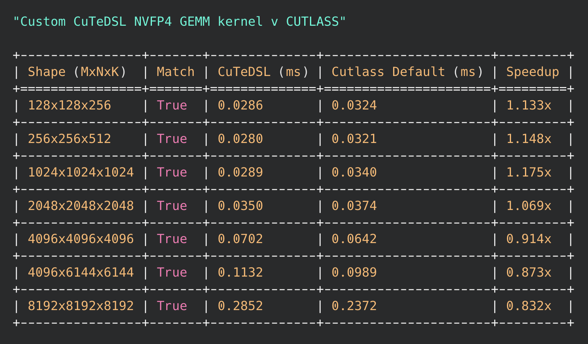

# Custom CuTeDSL NVFP4 GEMM kernel

When compared to a CUTLASS example NVFP4 GEMM, it looks like below.

Notes:

- Moves both scale factors to TMEM before starting any MMA
- Tcgen05 `cp` and Tcgen05 `mma` instructions are pipelined implicitly. From the PTX docs: The asynchronous tcgen05 operations may execute and complete in a different order than they were issued. However, some specific pairs of the asynchronous tcgen05 instructions form tcgen05 pipelines, where in the two asynchronous operations are guaranteed to execute in the same order as the instructions that issued them. The specific pairings are as follows:
    - tcgen05.mma.cta_group::N -> tcgen05.mma.cta_group::N (same N and accumulator, shape and kind)
    - tcgen05.cp.cta_group::N -> tcgen05.mma.cta_group::N (same N)
    - tcgen05.shift.cta_group::N -> tcgen05.mma.cta_group::N (same N)
    - tcgen05.shift.cta_group::N -> tcgen05.cp.4x256b.cta_group::N (same N)
    - tcgen05.mma.cta_group::N -> tcgen05.shift.cta_group::N (same N)
- Instead of frying my brain around SMEM layout for scale factors, I thought it's better to just flatten them (have a good quant kernel that does the layout swizzle for you internally) and perform `cp.async.bulk` 1D copy.
- Transferring from SMEM to TMEM is easier with index math, or I'm just bad at CuTe layouts.
